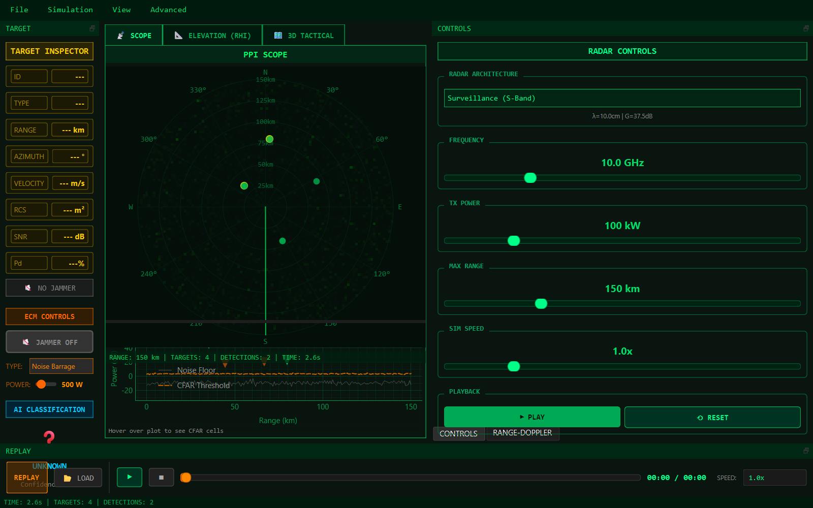
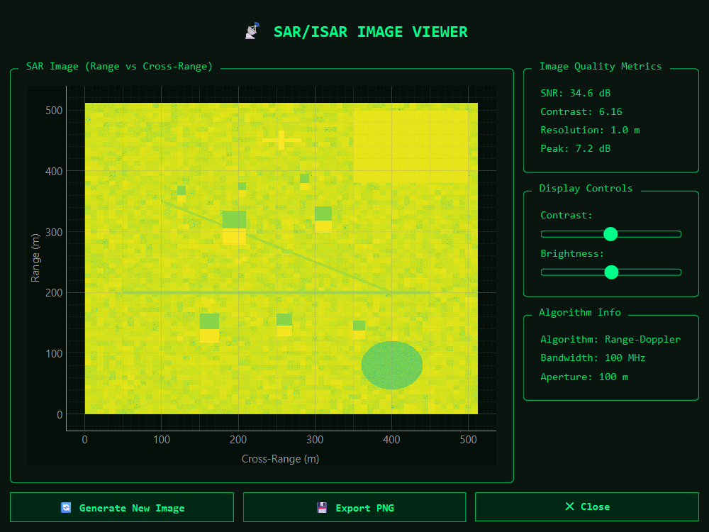
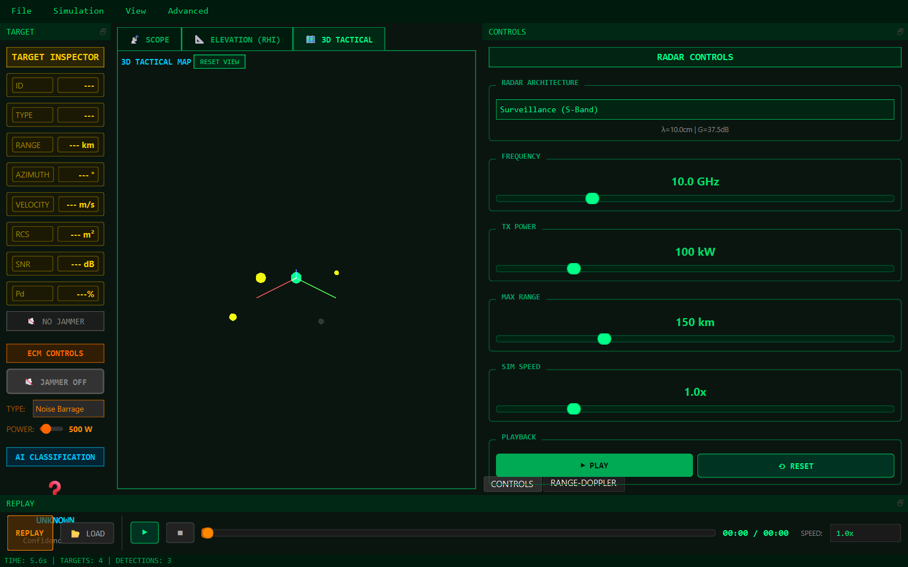
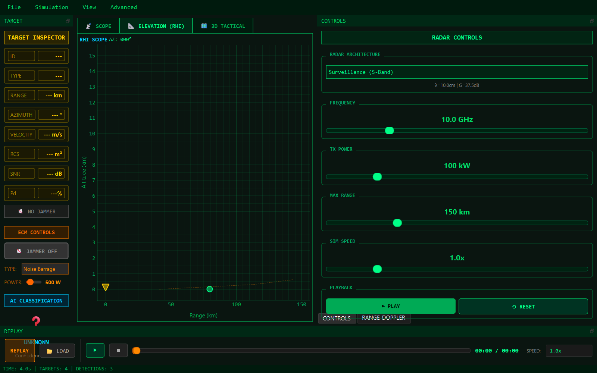
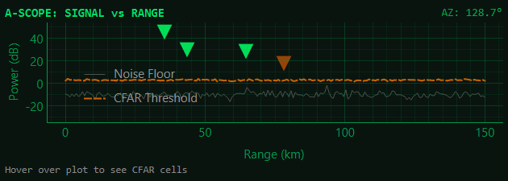
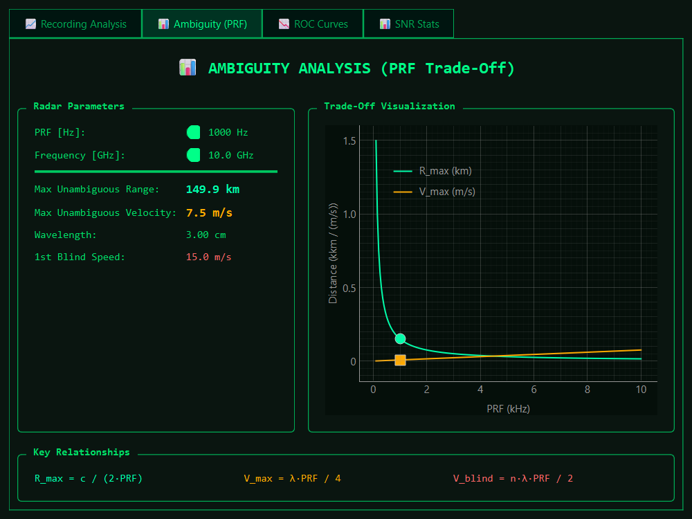
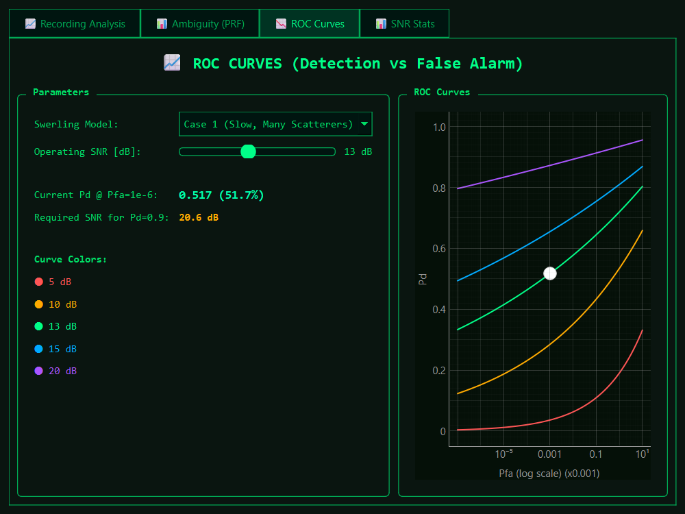
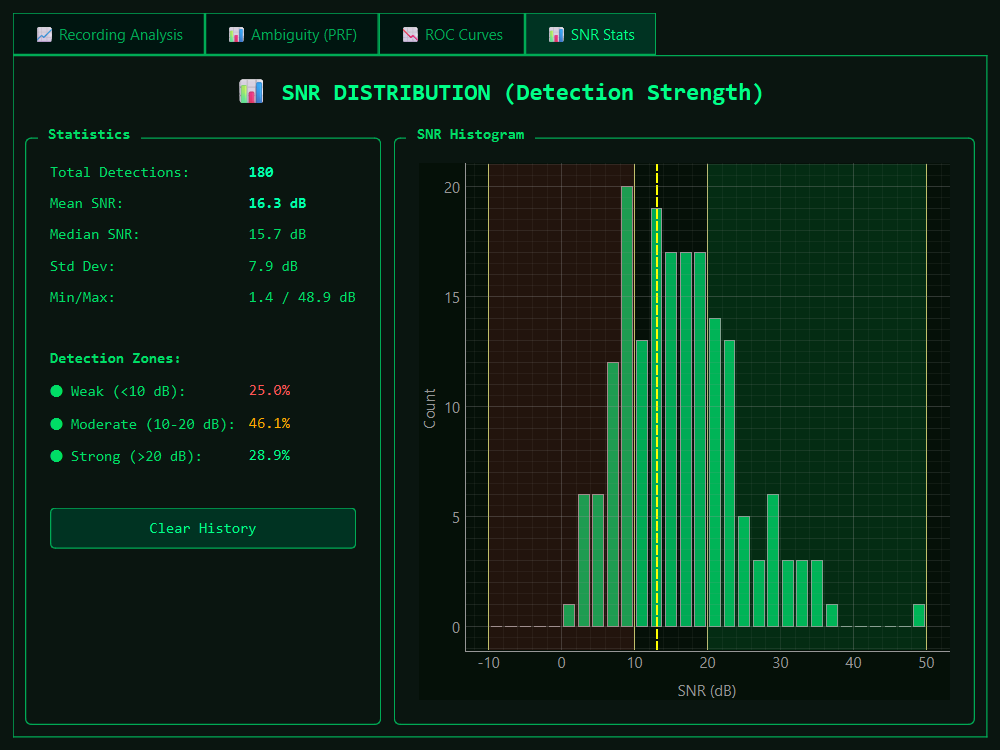

<p align="center">
  
</p>

<h1 align="center">RadarSim v1.0</h1>

<p align="center">
  <b>Professional Pulse-Doppler Radar Simulation Platform</b><br>
  <i>Physics-Based • AI-Enhanced • Open Source</i>
</p>

<p align="center">
  <a href="#features">Features</a> •
  <a href="#quick-start">Quick Start</a> •
  <a href="#keyboard-shortcuts">Shortcuts</a> •
  <a href="#documentation">Docs</a> •
  <a href="#citation">Citation</a>
</p>

<p align="center">
  
  
  
  
</p>

---

## 📖 Overview

**RadarSim** is a scientifically-validated radar simulation engine for education, research, and professional training. Built with NumPy/Numba for performance and PyQt6 for a modern UI.

**Key Validation:** Radar Equation calculations achieve ±0.005 dB accuracy vs. Skolnik reference values.


*Figure 1: Main Plan Position Indicator (PPI) display showing detected targets.*

---

## ✨ Features

### 🎯 Physics Engine
| Feature | Implementation | Reference |
|---------|----------------|-----------|
| **Radar Equation** | Monostatic/Bistatic with Numba JIT | Skolnik, Ch. 2 |
| **Atmospheric Attenuation** | ITU-R P.676-12 (O₂ + H₂O) | IEEE Std |
| **Swerling RCS Models** | Types 0-4 fluctuation | Swerling (1960) |
| **Monopulse Tracking** | Sum/Difference patterns, sub-beamwidth accuracy | Phase 20 |
| **3D Terrain Masking** | 4/3 Earth refraction, LOS shadowing | ITU-R P.526 |

### 🌪️ Environmental Effects
| Feature | Details |
|---------|---------|
| **Ground Clutter** | Weibull distribution, σ⁰ coefficients |
| **Sea Clutter** | **GIT Model**, Douglas sea states (1-6) |
| **Rain Physics** | ITU-R P.838 Attenuation + Marshall-Palmer Clutter |
| **MTI Filtering** | Velocity threshold, slow-mover rejection |

### ⚔️ Electronic Warfare
| Technique | Type | Status |
|-----------|------|--------|
| Noise Jamming | ECM | ✅ |
| DRFM Repeater | ECM | ✅ |
| RGPO/VGPO Deception | ECM | ✅ |
| **Frequency Agility** | ECCM | ✅ New |
| **Burn-Through Display** | ECM Strobe | ✅ New |

### 📊 Visualization Scopes
| Scope | Description |
|-------|-------------|
| **PPI** | Plan Position Indicator with phosphor decay |
| **B-Scope** | Range vs Azimuth (AESA style) with ECM strobes |
| **A-Scope** | Amplitude vs Range with CFAR hover visualization |
| **RHI** | Range-Height Indicator (elevation) |
| **3D Tactical** | OpenGL terrain with target spheres |
| **SAR Viewer** | Real physics-based Synthetic Aperture Radar imaging |

### 📸 Visualization Gallery

| SAR Imaging | 3D Tactical Map |
|:-----------:|:---------------:|
|  |  |
| *Real-time SAR formation (Range-Doppler)* | *3D situation awareness* |

| RHI Scope | A-Scope Analysis |
|:---------:|:----------------:|
|  |  |
| *Elevation scanning (Range-Height)* | *CFAR threshold visualization* |

### 📈 Analysis Tools
| Tool | Function |
|------|----------|
| **Ambiguity Diagram** | PRF vs Range/Velocity trade-off |
| **ROC Curves** | Pd vs Pfa for Swerling models |
| **SNR Histogram** | Detection strength distribution |

### 📊 Analysis Tools

<p align="center">
  
  
  
</p>
<p align="center">
  <i>Ambiguity Diagram • ROC Curves • Real-time SNR Statistics</i>
</p>

### 🤖 AI/ML Pipeline
- **RandomForest Classifier** trained on synthetic radar data
- **Classes:** Drone 🛸, Fighter Jet ✈️, Missile 🚀
- **Real-time inference** with confidence scoring

---

## 🚀 Quick Start

```bash
# Clone repository
git clone https://github.com/SpaceEngineerSS/RadarSim.git
cd RadarSim

# Create virtual environment
python -m venv .venv
.venv\Scripts\activate  # Windows
# source .venv/bin/activate  # Linux/Mac

# Install dependencies
pip install -r requirements.txt

# Run application
python run_gui.py
```

---

## ⌨️ Keyboard Shortcuts

| Key | Action |
|-----|--------|
| `Space` | Play/Pause simulation |
| `R` | Reset (stop) simulation |
| `1` | Switch to PPI Scope |
| `2` | Switch to RHI Scope |
| `3` | Switch to 3D Tactical |
| `4` | Switch to 4th tab |
| `F11` | Toggle fullscreen |
| `Ctrl+O` | Load scenario |
| `Ctrl+Shift+S` | Save scenario |
| `Ctrl+R` | Start recording |

---

## 📁 Project Structure

```
RadarSim/
├── run_gui.py              # Main entry point
├── requirements.txt        # Dependencies
├── scenarios/              # YAML scenario files
│   ├── air_defense.yaml
│   ├── coastal.yaml
│   └── ...
├── src/
│   ├── physics/            # Core physics (radar_equation, clutter, ecm)
│   ├── signal/             # Signal processing (cfar, doppler, sar)
│   ├── tracking/           # Target tracking (kalman, monopulse)
│   ├── simulation/         # Simulation engine
│   ├── ui/                 # PyQt6 GUI components
│   ├── advanced/           # SAR/ISAR, Sensor Fusion, LPI
│   └── ml/                 # AI classification pipeline
├── models/                 # Trained ML models
├── docs/                   # Documentation
└── tests/                  # Unit tests
```

---

## 📚 Documentation

| Document | Description |
|----------|-------------|
| [Physics Engine](docs/physics.md) | Radar equation, Monopulse, Ambiguity |
| [Signal Processing](docs/signal_processing.md) | CFAR, MTI, SAR algorithms |
| [User Guide](docs/user_guide.md) | GUI walkthrough and Advanced features |

---

## 🔬 Scientific References

1. **Skolnik, M.I.** - *Radar Handbook*, 3rd Ed., McGraw-Hill, 2008
2. **Richards, M.A.** - *Fundamentals of Radar Signal Processing*, 2nd Ed., McGraw-Hill, 2014
3. **IEEE Std 686-2017** - Radar Definitions
4. **ITU-R P.676-12** - Attenuation by Atmospheric Gases
5. **Cumming & Wong** - *Digital Processing of SAR Data*, Artech House, 2005

---

## 📜 License

MIT License - See [LICENSE](LICENSE) for details.

---

## 📖 Citation

If you use RadarSim in academic work, please cite:

```bibtex
@software{radarsim2025,
  title = {RadarSim: Physics-Based Pulse-Doppler Radar Simulation},
  author = {RadarSim Contributors},
  year = {2025},
  url = {https://github.com/SpaceEngineerSS/RadarSim}
}
```

---

## 👨‍💻 Developer

**Mehmet Gümüş**
* 🌐 Website: [spacegumus.com.tr](https://spacegumus.com.tr)
* 🐙 GitHub: [@SpaceEngineerSS](https://github.com/SpaceEngineerSS)

---

<p align="center">
  <b>Built with ❤️ for the Radar Community</b>
</p>