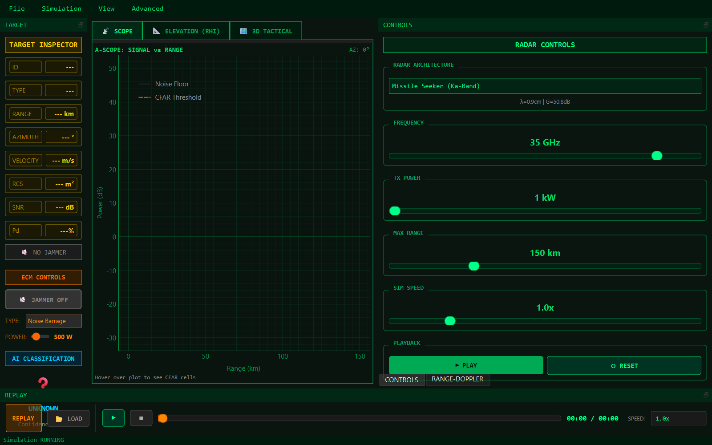

# RadarSim

RadarSim is an open-source, physics-based radar simulation and signal-processing workbench. It connects a time-domain scenario engine to radar-equation analysis, statistical detection, clutter and propagation models, electronic countermeasures, tracking, multisensor fusion, pulse-Doppler processing, and SAR/ISAR imaging.

Version 3.0 is a scientific-model revision. The signal-processing paths operate on complex samples, estimators carry covariance and time, and each empirical model states its validity limits. RadarSim is suitable for education, algorithm development, and reproducible engineering studies. It is not a certified sensor-performance predictor and does not contain classified equipment data.



## Capabilities

- Monostatic radar equation with explicit transmit power, gain, wavelength, RCS, loss, noise bandwidth, temperature, and noise figure terms
- Albersheim threshold approximation and Swerling 0/I/II/III/IV fluctuation models
- ITU-R P.676 gaseous absorption and ITU-R P.838 rain attenuation
- Land clutter using a gamma-table model or the Oh et al. (1992) bare-soil model; sea clutter using the NRL 2012 empirical model
- Weibull and K-distributed clutter samples, resolution-cell geometry, and rain-volume reflectivity
- LFM pulse generation, delayed complex-IQ echoes, matched filtering, MTI, Doppler FFT, ambiguity axes, window coherent gain, and equivalent noise bandwidth
- CA-, GO-, SO-, and OS-CFAR with false-alarm-calibrated thresholds; rectangular two-dimensional CA-CFAR
- Noise jamming, chaff, DRFM range/velocity gate pull-off, false targets, burn-through analysis, and receiver hard limiting
- Linear KF and polar-measurement EKF tracking, normalized-innovation-squared gating, Hungarian assignment, confirmation, coasting, and deletion logic
- Timestamp-aligned network tracks, bearing-only triangulation, covariance intersection, and independent-Gaussian fusion
- Stripmap SAR raw-data generation and range-Doppler focusing with range-cell migration correction; range-Doppler ISAR with profile alignment
- PySide6 desktop displays for PPI, RHI, A-scope, tactical 3-D view, tracking, recording analysis, and SAR/ISAR products
- YAML/JSON scenarios, HDF5 recording/replay, and CSV/JSON/GeoJSON/KML export

## Installation

RadarSim supports Python 3.9 through 3.12.

```bash
git clone https://github.com/SpaceEngineerSS/RadarSim.git
cd RadarSim
python -m venv .venv
```

Activate the environment, then install the application:

```bash
python -m pip install --upgrade pip
python -m pip install -e ".[gui]"
```

For development and documentation dependencies:

```bash
python -m pip install -e ".[gui,dev,docs]"
```

## Running the desktop application

```bash
radarsim
```

From a source checkout, `python run_gui.py` is equivalent. Open a file from `scenarios/` through the scenario dialog, start the simulation, and select a contact or track to inspect its range, radial velocity, SNR/SJNR, probability of detection, and receiver state.

For headless use:

```python
from src.io.scenario_loader import ScenarioLoader

loader = ScenarioLoader("scenarios/basic_tracking.json")
engine = loader.create_simulation_engine()

for _ in range(100):
    detections = engine.step()
```

The executable examples in `examples/api_examples.py` cover the radar equation, atmospheric attenuation, Swerling statistics, pulse-Doppler processing, CFAR, tracking, and scenario loading.

## Scientific scope

RadarSim distinguishes implemented physics from simplifying assumptions:

- Propagation is a homogeneous-path approximation. It does not ray-trace refractivity, diffraction, ducting, or multipath.
- RCS is a point-target mean or statistical fluctuation, not a full-wave electromagnetic solution.
- Clutter models return empirical normalized backscatter within their documented frequency, grazing-angle, polarization, and surface constraints.
- Noise and CFAR calibration assume the distributions stated in the API; heterogeneous clutter changes the achieved false-alarm rate.
- The tracker uses constant-velocity dynamics. Maneuver process noise must be selected for the scenario.
- SAR uses broadside stripmap geometry and a range-Doppler processor. The omega-k and chirp-scaling entry points intentionally report that they are not implemented.
- ISAR assumes a usable target rotation rate and translational alignment; severe nonuniform rotation requires a more advanced autofocus or time-frequency method.

Equations, units, assumptions, and validation coverage are documented in [Physics models](docs/physics.md), [Signal processing](docs/signal_processing.md), [ECM and receiver effects](docs/ecm.md), [Model fidelity](docs/MODEL_FIDELITY.md), and [Scientific methodology](docs/SCIENTIFIC_METHODOLOGY.md). The primary literature and standards are collected in [References](docs/REFERENCES.md).

## Reproducibility and testing

Randomized components accept or preserve NumPy random state where their API exposes stochastic behavior. Tests use fixed seeds and check invariants, analytic identities, statistical moments, ambiguity relations, estimator consistency, and UI construction.

```bash
python -m ruff check src tests
python -m pytest -q
python -m bandit -r src -x tests -ll
python -m build
```

The current suite contains 341 tests. See [CONTRIBUTING.md](CONTRIBUTING.md) for model-change requirements and [CHANGELOG.md](CHANGELOG.md) for release history.

## License and citation

RadarSim is licensed under the [MIT License](LICENSE). If it contributes to published work, cite the repository metadata in [CITATION.cff](CITATION.cff) and state the RadarSim version, scenario file, random seed, and any changed model parameters.
